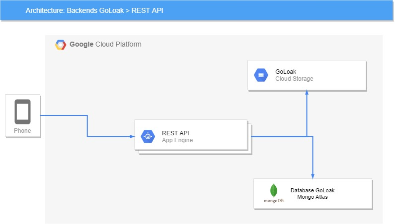
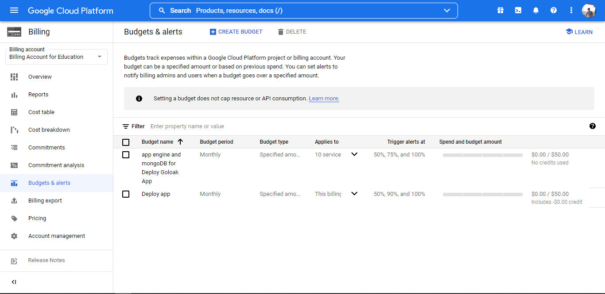
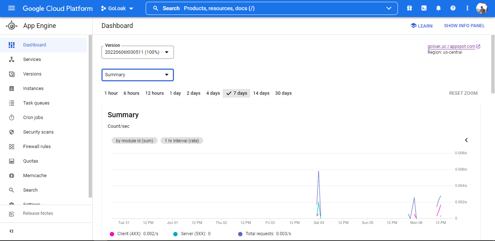
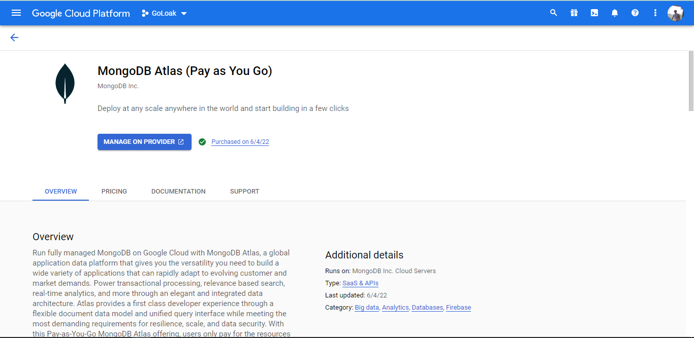
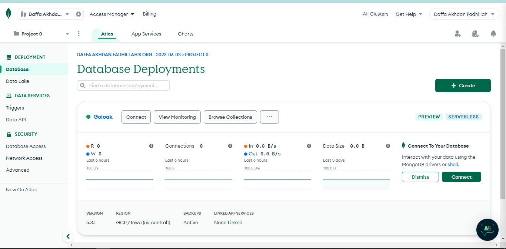

# Cloud Computing Documentation

- [GoLoak REST API](https://github.com/GoLoak/GoLoak-Cloud-Computing)

## Design Architecture

## Tools & IDE
* VS Code
* Postman

## Agenda Google Cloud Platform

* Prepare budgets & alerts

* Deploy REST API

* Database with MongoDB

## reference
* [Google Cloud](https://cloud.google.com/appengine/docs/standard/nodejs/using-cloud-storage)
* [Express Starter](https://github.com/or-abdillh/express-starter)
* [MongooSE](https://mongoosejs.com/docs/)
